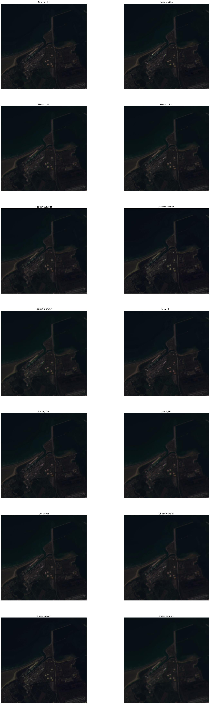
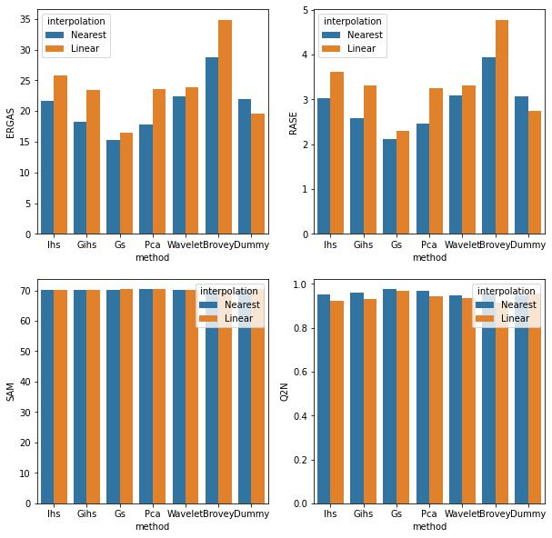

# Welcome to Pansharpening
### General purpose Pansharpening or Image Fusion library

*Currently under construction*

This package provides general purposes implementation of most common pansharpening algorithm along with the best practice procedure to quantitatively assess and compare pansharpening algorithm.

As feature it supports:
In term of Pansharpening algorithms:
- Ihs
- Gihs
- Gs
- Pca
- Wavelet
- Brovey
- Dummy (for comparison purposes)

In term of QA algorithms:
- RMSE
- ERGAS
- RASE
- SAM
- Q2N

### Minimal Example

```python

```

### Example with running all

Check the ./Pansharpening/demo.ipynb for the code.

Images Output:


Stats Output:


